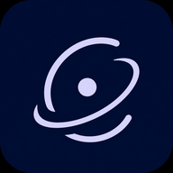

<div align="center">



# Orvia

**An open-source AI chat and workspace app built on Kelivo.**

Bring your own models, customize your conversations, and connect tools through MCP.

[Roadmap](https://github.com/dude555afk/Orvia/issues/1) · [Releases](https://github.com/dude555afk/Orvia/releases) · [Builds](https://github.com/dude555afk/Orvia/actions) · [Report a bug](https://github.com/dude555afk/Orvia/issues)

</div>

## About

Orvia is an independent fork of [Kelivo](https://github.com/Chevey339/kelivo), built with Flutter. It carries forward Kelivo's chat, customization, memory, and workspace foundation while developing its own identity and integrations.

**Orvia is still in bootstrap development.** Branding and package migration are incomplete, and features or build results on a pull-request branch may differ from `main`. The inherited project includes Android, iOS, macOS, Windows, and Linux targets; this does not mean every Orvia target has been verified.

## Features inherited from Kelivo

- **Flexible model connections** — OpenAI-compatible endpoints, OpenAI, Gemini, Claude, and other supported providers, with configurable model capabilities and reasoning controls.
- **Conversations and memory** — assistants, conversation branches, response versions, temporary chats, long-term memory, world books, and context compression.
- **Tools and workspaces** — file operations, shell commands, skills, and workspace environments. Android uses PRoot; desktop workspaces use the native shell.
- **MCP connections** — HTTP, SSE, and STDIO transports, configuration import, OAuth support, and tool approval controls.
- **Search, voice, and attachments** — configurable search services, text-to-speech, speech recognition, images, and documents, depending on the selected provider and platform.
- **Customizable interface** — light and dark themes, dynamic colors, wallpapers, fonts, and message styling.
- **Local data and backups** — local conversations and settings, with local-file, WebDAV, and S3-compatible backup options.

Provider availability, authentication, pricing, and limits are set by the services you choose. Orvia does not include an unlimited AI subscription.

## Bootstrap status

Track implementation and verification in [issue #1](https://github.com/dude555afk/Orvia/issues/1).

| Work | Status |
| --- | --- |
| Imported Flutter foundation | Present in this repository |
| Orvia identity and optional MCP starter catalogue | Proposed in [PR #2](https://github.com/dude555afk/Orvia/pull/2); not merged |
| Android Kotlin package migration | Proposed in [PR #3](https://github.com/dude555afk/Orvia/pull/3); not merged |
| Complete branding, icons, splash, and release metadata | Still part of the bootstrap roadmap |
| Regional default services and strings | Audit individually while retaining multilingual support |
| Tool-loop and permission review | Roadmap work |
| Native email setup, inbox, threads, drafts, and replies | Planned; sending and deletion require confirmation |
| CI and Android debug APK | Must be verified on the combined migration before bootstrap is complete |

The proposed MCP catalogue adds optional presets disabled by default, without prefilled credentials. It is separate from the existing MCP connection functionality.

The internal Dart package is currently `Kelivo`, and imports use `package:Kelivo/...`. Product branding and Dart package naming are separate: changing the package name requires updating its imports together.

Orvia is a separate repository from Kairon.

## Getting started

1. Install an Orvia build from this repository's [Releases](https://github.com/dude555afk/Orvia/releases), when available, or download an artifact from a successful [Actions run](https://github.com/dude555afk/Orvia/actions). Check the branch, commit, and target architecture.
2. Open **Settings → Providers**, add your provider or compatible endpoint, and configure any required credentials.
3. Select a model and start a conversation.
4. Configure search, voice, MCP, and workspace tools as needed. Review each connection and its permissions before enabling it.

Kelivo's upstream releases and app-store listings are builds of Kelivo, not Orvia. Development artifacts may contain unfinished migration work.

## Data and permissions

Conversations and settings are stored locally. Requests to cloud models, search services, MCP servers, or cloud voice providers send the relevant data to those services. Optional remote backups upload data to the destination you configure.

Keep credentials out of source control and review tool calls before granting access. Desktop workspace commands run with your user account's permissions and are not sandboxed.

## Build from source

Use Flutter **3.44.9** to match the existing CI configuration. The package requires Dart **3.12.1 or later within Dart 3**.

For Android, install the Android SDK and a compatible Java toolchain. The PRoot setup also uses `bash`, `python3`, `curl`, and `tar`; Gradle invokes the download script.

```bash
git clone https://github.com/dude555afk/Orvia.git
cd Orvia
flutter pub get
flutter run
```

Build an ARM64 Android debug APK:

```bash
flutter build apk --debug --target-platform android-arm64
```

Output: `build/app/outputs/flutter-apk/app-debug.apk`.

These are build instructions, not a guarantee that every branch currently builds. Check the latest CI results and open migration PRs when troubleshooting.

Several packages are vendored in [dependencies/](dependencies) and referenced by path. Other platforms require their corresponding native toolchains.

## Contributing

Read [AGENTS.md](AGENTS.md) for architecture and contribution guidelines. Keep changes focused and distinguish implemented features from roadmap proposals.

For code changes, run the repository checks:

```bash
dart format lib test
dart analyze --fatal-infos lib test
flutter test
```

Localization lives in [lib/l10n/](lib/l10n), with `app_en.arb` as the template. Run `flutter gen-l10n` after editing translations and commit the generated output.

Report bugs with the app version or commit, platform, reproduction steps, and relevant logs with credentials removed.

## Credits and license

Orvia is based on [Kelivo](https://github.com/Chevey339/kelivo), licensed under the **GNU Affero General Public License v3.0**. Preserve the original copyright, license, and third-party notices when redistributing or modifying the project. See [LICENSE](LICENSE).

The bootstrap roadmap references [Kai](https://github.com/SimonSchubert/Kai), licensed under Apache-2.0, for MCP catalogue inspiration and integration work. Preserve applicable attribution and notices for any adapted code.

Additional upstream acknowledgements:

- [RikkaHub](https://github.com/re-ovo/rikkahub) — inspiration for Kelivo's interface.
- [Minis](https://github.com/OpenMinis/OpenMinis), [iSH-ARM64](https://github.com/OpenMinis/ish-arm64), and [iSH](https://github.com/ish-app/ish) — the inherited iOS sandbox foundation.
- [PRoot](https://github.com/termux/proot) and [Termux](https://termux.dev) — Android sandbox components.
- [sherpa-onnx](https://github.com/k2-fsa/sherpa-onnx) — offline speech recognition.
- The open-source dependencies listed in [pubspec.yaml](pubspec.yaml).

Sandbox notices: [iOS NOTICE](ios/sandbox/NOTICE) · [Android NOTICE](android/app/src/main/jniLibs/NOTICE).
